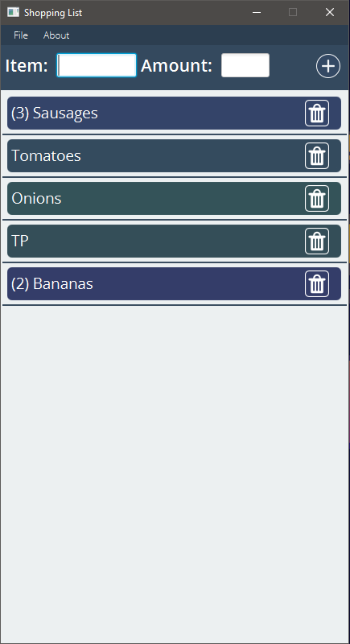

# Shopping List Application
The project consists of two parts:

## EzParser

### A self-made JSON parsing library, used to store data from the shopping list.

A simple JSON parsing library, which can be used to save simple Java objects to a JSON file and read the objects from the file as well.

## Shopping List

### A simple desktop shopping list application made in Java.

A very simple desktop shopping application. Saves list items in a JSON file using the EzParser library and reads them from the JSON file as well. Has functionality to save the items to a MySQL database using Hibernate.

